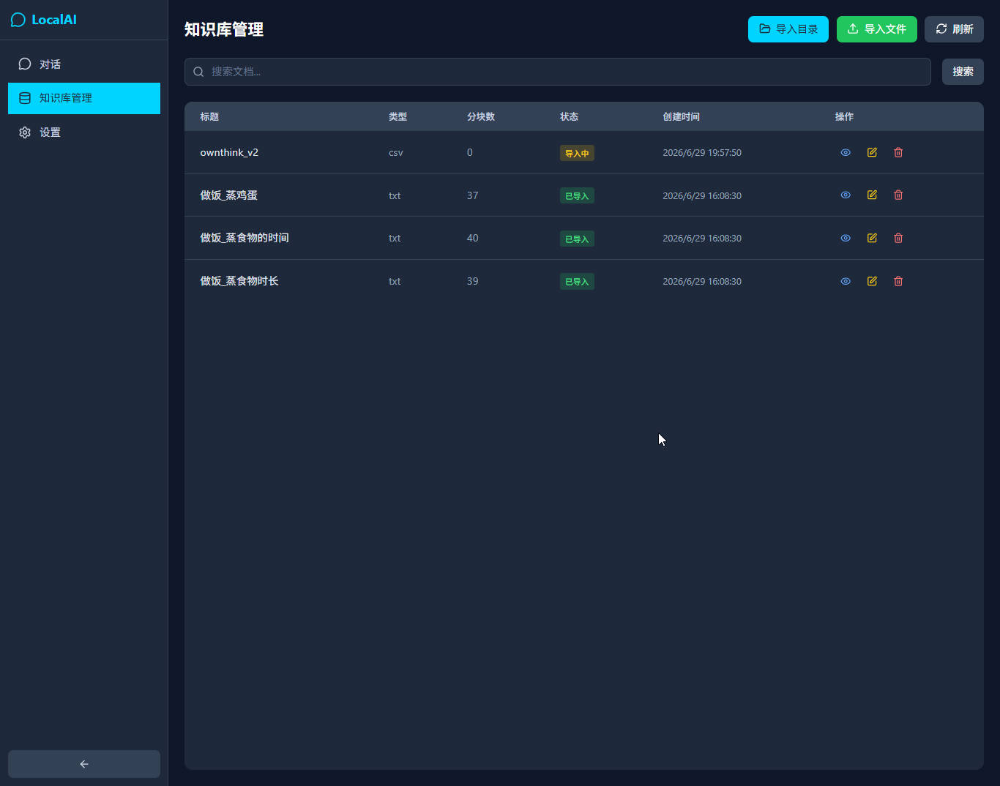
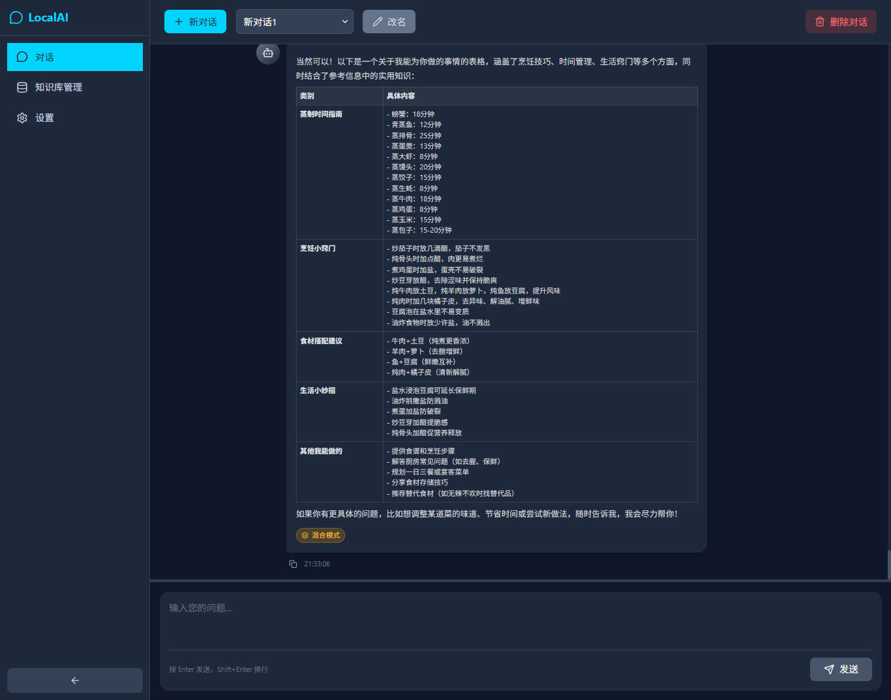
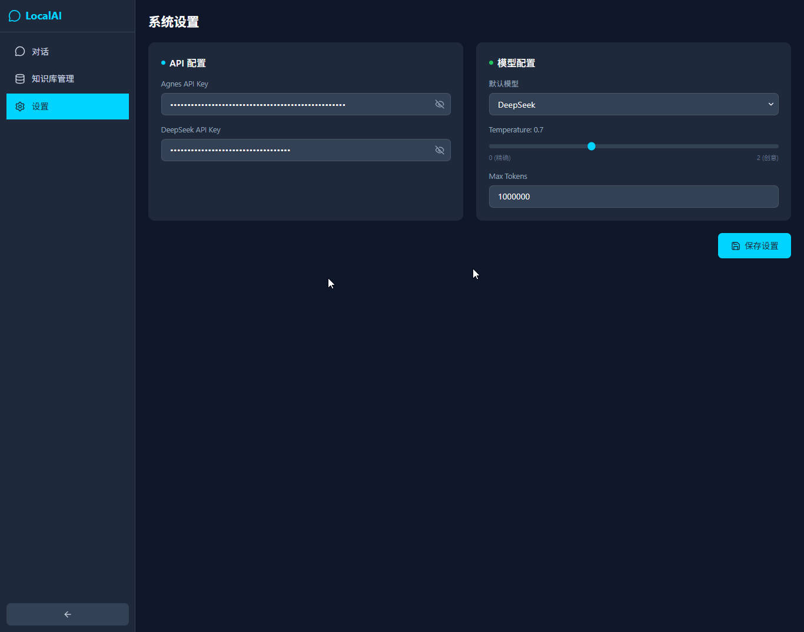

# 🧠 LocalAI - Local Knowledge Base Q&A System

[](https://opensource.org/licenses/MIT) [](https://nodejs.org/) [](https://vuejs.org/) [](https://vitejs.dev/)

LocalAI is an intelligent Q&A system based on a local knowledge base. It supports multiple document formats and combines with large language models (LLM) to provide accurate Q&A services. All data is stored locally, ensuring your privacy.

## ✨ Features

### 📚 Knowledge Base Management
- **Multi-format Support**: TXT, CSV, Markdown, HTML, Word, Excel and more
- **Batch Import**: Special a document or a directory with automatic parsing and vectorization
- **Smart Retrieval**: Fast knowledge retrieval using vector search technology
- **Visual Preview**: View imported knowledge base content

### 🤖 Intelligent Q&A
- **Hybrid Retrieval**: Combines knowledge base search with LLM capabilities
- **Streaming Response**: Real-time answer generation for better UX
- **Multi-model Support**: Supports DeepSeek, Agnes, and other LLMs
- **Conversation History**: Auto-saves chat history for reference

### ⚙️ System Settings
- **Model Configuration**: Flexible switching between different LLMs
- **Parameter Tuning**: Adjust temperature, max tokens, and other parameters
- **API Management**: Configure API keys for multiple models

## 🎯 Use Cases

- **Enterprise Knowledge Base**: Build internal document Q&A systems
- **Personal Knowledge Assistant**: Manage personal notes and documents
- **Customer Service**: Build intelligent support based on product documentation
- **Education & Training**: Create course material Q&A systems

## 🛠️ Tech Stack

### Backend
- **Node.js** - JavaScript runtime
- **Express** - Web framework
- **Qdrant** - High-performance vector database (default)
- **hnswlib-node** - Local vector index library (optional fallback)
- **better-sqlite3** - Lightweight database
- **Axios** - HTTP client

### Frontend
- **Vue 3** - Progressive JavaScript framework
- **Vite** - Fast build tool
- **Pinia** - Vue state management
- **Axios** - HTTP client
- **Tailwind CSS** - CSS framework
- **Lucide Vue** - Icon library

### Vectorization & AI
- **Qdrant** - High-performance vector database, supports local / Docker / cloud deployment
- **DeepSeek API** - Large language model
- **Semantic Vector Retrieval** - Intelligent document search via vector similarity

## 📦 Quick Start

### Prerequisites

- Node.js >= 18.0.0
- npm >= 9.0.0
- Qdrant vector database (recommended quick deploy via Docker)

### Installation

1. **Clone the repository**
```bash
git clone https://github.com/xuqb1/localai.git
cd localai
```

2. **Install backend dependencies**
```bash
cd server
npm install
```

3. **Start Qdrant vector database** (recommended via Docker)
```bash
docker run -d --name qdrant -p 6333:6333 -v qdrant_storage:/qdrant/storage qdrant/qdrant
```
> You can also use an existing Qdrant service or cloud-hosted version. If you prefer not to deploy Qdrant, set `VECTOR_DB_TYPE=hnswlib` to fallback to local mode.

4. **Install frontend dependencies**
```bash
cd ../client
npm install
```

5. **Configure environment variables**

Create server/.env file:

```env
# DeepSeek API
DEEPSEEK_API_KEY=your_deepseek_api_key
DEEPSEEK_BASE_URL=https://api.deepseek.com/v1

# Agnes API (optional)
AGNES_API_KEY=your_agnes_api_key
AGNES_BASE_URL=https://api.agnes.ai/v1

# Vector database configuration
VECTOR_DB_TYPE=qdrant
QDRANT_HOST=localhost
QDRANT_PORT=6333
QDRANT_API_KEY=
QDRANT_COLLECTION=localai_documents

# Server configuration
PORT=3001
NODE_ENV=development
```
### Start services

1. **Start backend:**

```bash
cd server
npm run dev
```
2. **Start frontend (new terminal):**
```bash
cd client
npm run dev
```
3. **Access the application**

Open browser at http://localhost:5173

## 📖 User Guide
1. **Import Knowledge Base**
Click on "Knowledge Manage" menu

Select "Import File"

Special the directory and filename, supported files (TXT, CSV, MD, HTML, DOCX, XLSX, etc.)

Press Import button, then System automatically parses and vectorizes documents

2. **Start Chatting**
Click "New Chat" to create a session

Enter your question

System retrieves from knowledge base and generates answers

Answers include source references for verification

3. **System Settings**
Configure model parameters in "Settings"

Switch between different LLMs

Adjust temperature, max tokens, and other parameters

## 📄 License
This project is licensed under the MIT License.

## 💰 Support the Project
If LocalAI has been helpful to you, consider supporting us!
    


## 📞 Contact
Author: xuqb1

Email: qb_xu@126.com

GitHub: https://github.com/xuqb1

## 🙏 Acknowledgments
DeepSeek - Powerful LLM

Qdrant - High-performance vector database

hnswlib - High-performance vector search

Vue.js - Excellent frontend framework

Tailwind CSS - Practical CSS framework

⭐ If this project helps you, please give it a Star!